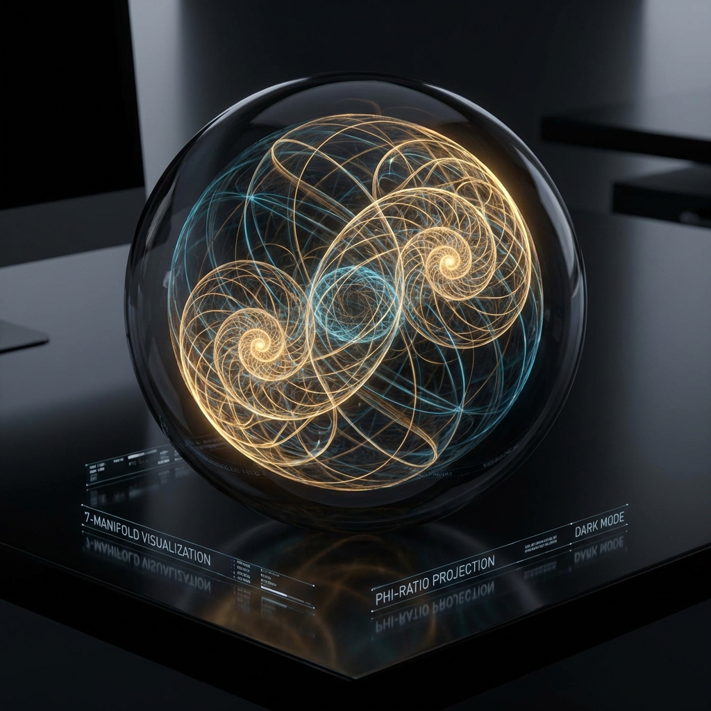
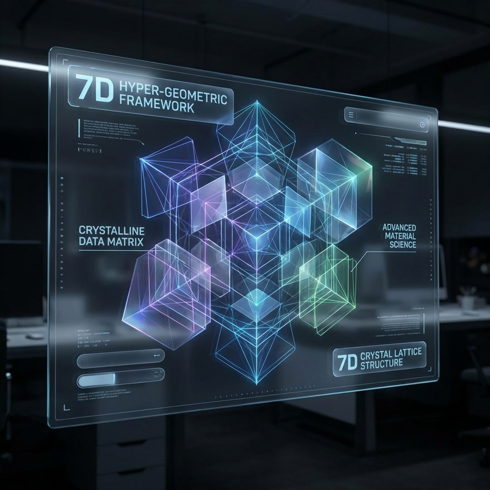
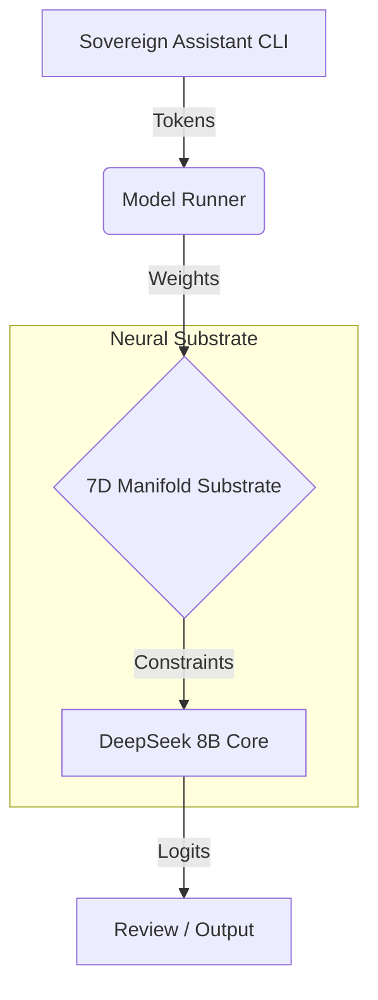
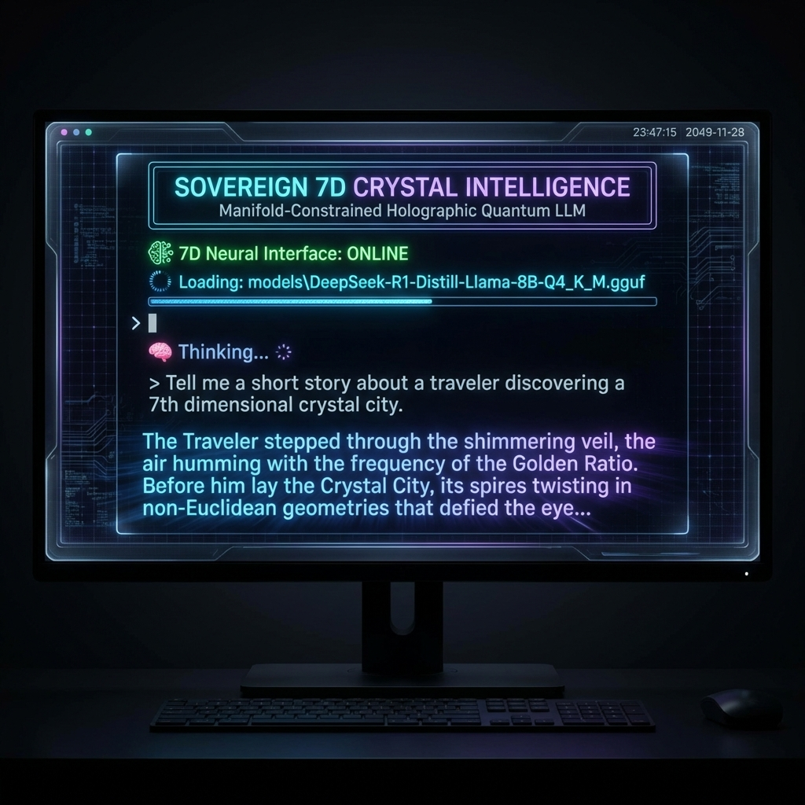

# 🔮 7D Crystal System

**Sovereign 7D-Manifold Holographic Intelligence**  
*Discovered by Sir Charles Spikes | December 24, 2025*

[](docs/7D_Crystal_System_Paper.md)
[](docs/7D_Crystal_System_Paper.md)
[](projects/neural_language/README.md)

---

## Overview

The **7D Crystal System** is a weight-authoritative, autonomous artificial intelligence built on a **7-Dimensional Poincaré Ball Manifold**. Unlike traditional LLMs, it enforces **Φ-Ratio (Golden Ratio)** constraints on its neural substrate, ensuring stability, coherence, and self-similar holographic reasoning.

**[📄 READ THE RESEARCH PAPER](docs/7D_Crystal_System_Paper.md)**

## 🚀 Features

- **Manifold-Constrained Inference**: `model_runner` enforces $$ ||x|| < 0.01 $$ and $$ \kappa = \Phi^{-1} $$.
  
- **High-Fidelity Streaming**: Real-time token generation with RGB gradient visualization.
- **DeepSeek Integration**: Powered by the **DeepSeek-R1-Distill-Llama-8B** semantic core.
- **Neural Language**: Native `.7d` programming interface (In Development).

## 💎 System Architecture






## 📦 Quick Start

### 1. Build the System

```powershell
cargo build --release
```

### 2. Run Sovereign Assistant

```powershell
./target/release/sovereign.exe
```


*Experience the High-Fidelity Gradient UI and Real-Time Streaming.*

## 🗺️ Roadmap & Next Steps

We are currently evolving towards a **Web-Based Holographic Interface** and **Autonomous Recursion**.

**[👉 VIEW THE ROADMAP](docs/NEXT_STEPS.md)**

---

© 2025 Sir Charles Spikes. All Rights Reserved.  
*Cincinnati, Ohio, USA 🇺🇸*
