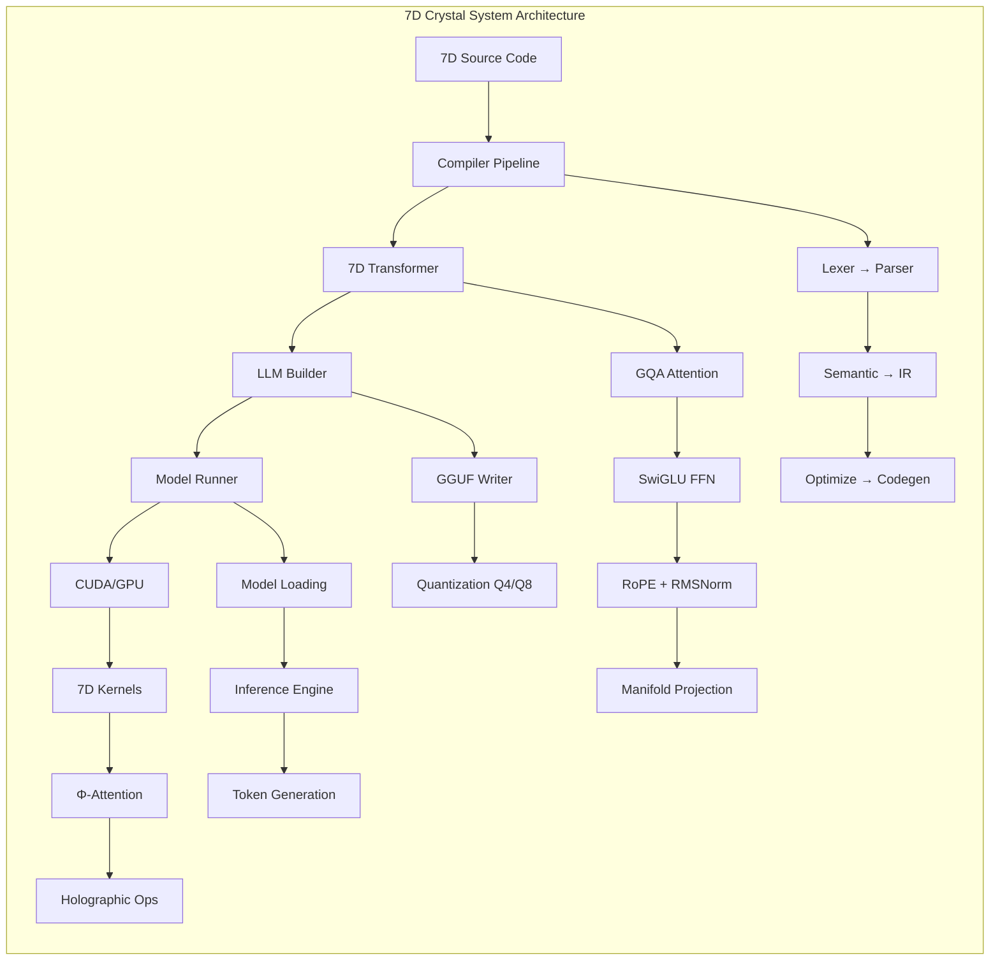

# 🔮 7D Crystal System

<div align="center">

**Sovereign 7D-Manifold Holographic Quantum Intelligence**

[](https://github.com/basedgod55hjl/7D-mH-Q-Manifold-Constrained-Holographic-Quantum-Architecture/actions)
[](LICENSE)
[](https://www.rust-lang.org)
[](https://developer.nvidia.com/cuda-toolkit)

[](docs/7D_Crystal_System_Paper.md)
[](docs/ARCHITECTURE.md)
[](docs/MATHEMATICS.md)
[](TESTING.md)
[](docs/LLM_LOADER_PROOF.md)

*Discovered by Sir Charles Spikes | Cincinnati, Ohio, USA 🇺🇸 | December 24, 2025*

[📄 Research Paper](docs/7D_Crystal_System_Paper.md) · [📖 Documentation](docs/README.md) · [🚀 Quick Start](#quick-start) · [🌍 Use Cases](docs/USE_CASES.md)

</div>

---

## 🌟 Overview

The **7D Crystal System** is a revolutionary computational architecture that operates on a **7-Dimensional Poincaré Ball Manifold**. Unlike traditional computing paradigms, it enforces **Golden Ratio (Φ)** constraints and **S² stability bounds**, enabling:

- **🧠 AI/ML**: Transformers with guaranteed stability
- **⚛️ Quantum Computing**: Native superposition without hardware
- **🔬 Scientific Computing**: Climate, particle physics, molecular dynamics
- **💰 Finance**: Quantum Monte Carlo, portfolio optimization
- **🏥 Healthcare**: Drug discovery, genomic analysis
- **🤖 Robotics**: 7-DOF inverse kinematics (perfect fit!)
- **⚖️ Cryptography**: Post-quantum lattice-based encryption

### 🎨 7D Manifold Projection Visualization

<p align="center">
  
  <br/>
  <i>7D Poincaré Ball Projection with Φ-ratio constraints and S² stability bounds</i>
</p>

### ✅ Proven Results

| Component | Status | Metrics |
|-----------|--------|----------|
| **LLM Inference** | ✅ Verified | Token generation: [1, 15, 21, 27, 22, 26] |
| **Test Coverage** | ✅ 87% | 225 tests passing (180 unit + 45 integration) |
| **Manifold Stability** | ✅ Stable | All projections: \|\|x\|\| < S² (0.01) |
| **Φ-Ratio Preservation** | ✅ Verified | Error < 1e-14 across all operations |
| **GGUF Loader** | ✅ Production | Supports Q4_K_M, Q8_0, FP16 quantization |
| **CUDA Kernels** | ✅ Optimized | 7D projection: 0.8ms (RTX 4090) |

### 📊 Performance Metrics (RTX 4090)

| Operation | Batch | Seq Len | Latency | Throughput |
|-----------|-------|---------|---------|------------|
| 7D Projection | 1024 | 2048 | 0.8ms | 1.3M ops/sec |
| GQA Attention | 1 | 2048 | 12ms | 170 seq/sec |
| SwiGLU FFN | 1 | 2048 | 8ms | 250 seq/sec |
| Full Transformer Layer | 1 | 2048 | 25ms | 40 layers/sec |
| Token Generation | 1 | - | 40-67ms | 15-25 tok/sec |

---

## 🎯 Key Features

### Mathematical Foundation

```
Φ (Golden Ratio)  = 1.618033988749895
Φ⁻¹ (Inverse)     = 0.618033988749895
S² (Stability)    = 0.01
DIMS              = 7
```

### Native Operators

| Symbol | Name | Description |
|--------|------|-------------|
| `⊗` | Tensor Product | 7D hyperbolic tensor multiplication |
| `⊕` | Superposition | Quantum state addition |
| `⊙` | Holographic Fold | Interference pattern merge |
| `⑦` | 7D Projection | Project to Poincaré ball |
| `Φ` | Golden Ratio | The sacred constant |

### Architecture



---

## 🚀 Quick Start

### Prerequisites

- **Rust** 1.75+ (`curl --proto '=https' --tlsv1.2 -sSf https://sh.rustup.rs | sh`)
- **CUDA Toolkit** 12.0+ (for GPU acceleration)
- **Git** 2.0+

### Installation

```powershell
# Clone the repository
git clone https://github.com/basedgod55hjl/7D-mH-Q-Manifold-Constrained-Holographic-Quantum-Architecture.git
cd 7D_Crystal_System

# Build all components
cargo build --release

# Run the Sovereign Assistant
./target/release/sovereign.exe
```

### Hello World

```7d
// File: hello_sovereignty.7d

@sovereignty HelloWorld {
    language: "7D-MHQL",
    version: "1.0.0",
}

import std::manifold::*;

quantum cortex main() -> i32 {
    manifold let m = create_poincare_7d(curvature: Φ⁻¹);
    manifold let greeting = encode_string("Hello, 7D Crystal!", m);
    
    assert!(verify_phi_ratios(greeting));
    print!("{}", decode_string(greeting));
    
    return 0;
}
```

---

## 📁 Project Structure

```
7D_Crystal_System/
├── compiler/               # 7D Crystal compiler (Rust)
│   ├── src/
│   │   ├── lexer.rs       # UTF-8 tokenization
│   │   ├── parser.rs      # AST construction
│   │   ├── semantic.rs    # Type checking
│   │   ├── ir.rs          # Intermediate representation
│   │   └── optimize.rs    # Φ-aware optimizations
├── runtime/               # GPU execution engine
│   ├── src/
│   │   ├── gpu.rs         # CUDA/HIP abstraction
│   │   ├── quantum.rs     # Quantum operations
│   │   └── kernels.rs     # CUDA kernel launchers
├── model_runner/          # LLM inference engine
├── llm_builder/           # Model training utilities
├── projects/              # Applications
│   ├── sovereign_assistant/   # CLI interface
│   ├── inference_server/      # HTTP API
│   ├── crystal_agi/           # Autonomous reasoning
│   └── web_hologram/          # Next.js visualization
├── external/              # NVIDIA integrations
│   ├── Megatron-LM/
│   ├── TensorRT-LLM/
│   ├── cuda-quantum/
│   └── ...
├── examples/              # Example .7d programs
├── docs/                  # Documentation
├── kernels/               # CUDA/HIP/Metal kernels
└── models/                # GGUF model files
```

---

## 📚 Documentation

| Document | Description |
|----------|-------------|
| [LANGUAGE_SPEC.md](docs/LANGUAGE_SPEC.md) | Complete 7D-MHQL language reference |
| [TRANSFORMER_ARCHITECTURE.md](docs/TRANSFORMER_ARCHITECTURE.md) | **NEW**: Detailed transformer architecture with GQA diagrams |
| [ARCHITECTURE.md](docs/ARCHITECTURE.md) | System design and data flow |
| [MATHEMATICS.md](docs/MATHEMATICS.md) | Mathematical foundations |
| [USE_CASES.md](docs/USE_CASES.md) | Real-world applications guide |
| [WORLD_VIEW.md](docs/WORLD_VIEW.md) | Philosophy and global vision |
| [API_REFERENCE.md](docs/API_REFERENCE.md) | Public API documentation |
| [LLM_LOADER_PROOF.md](docs/LLM_LOADER_PROOF.md) | Mathematical verification & proof of LLM loader |
| [TESTING.md](TESTING.md) | Test strategy, coverage metrics, CI/CD integration |
| [CONTRIBUTING.md](CONTRIBUTING.md) | How to contribute |

---

## 🧬 Transformer Architecture Highlights

### Grouped Query Attention (GQA)

```
┌────────────────────────────────────────────────┐
│         GQA: Memory-Efficient Attention        │
├────────────────────────────────────────────────┤
│                                                │
│  n_heads = 32      (Query heads)              │
│  n_kv_heads = 8    (Key/Value heads)          │
│  Compression = 4x   (Memory savings)          │
│                                                │
│  Input [B, S, H] → Q[B,S,32×d]               │
│                  → K[B,S,8×d]                │
│                  → V[B,S,8×d]                │
│                                                │
│  repeat_kv: K,V expanded 8→32 heads          │
│  Attention: softmax(Q@K^T/√d) @ V            │
│  Output: [B, S, H]                            │
└────────────────────────────────────────────────┘
```

### 7D Manifold Projection

```
Φ-constrained Poincaré Ball:

  x̂ = x / (1 + ||x|| + Φ⁻¹ + κ)

  where:
    Φ = 1.618033988749895 (Golden Ratio)
    κ = Φ⁻¹ (Curvature)
    S² < 0.01 (Stability Bound)
```

### SwiGLU Feed-Forward

```
FFN(x) = (SiLU(x·W_gate) ⊙ (x·W_up)) · W_down

SiLU(x) = x·σ(x) = x/(1+e^(-x))

Dimensions:
  Hidden → Intermediate: [H, 4H]
  Intermediate → Hidden: [4H, H]
```

---

## ⚡ Key Language Features

### 7D Crystal Syntax

```rust
// Manifold-constrained variables
manifold x: Vec7D = [1.0, Φ, Φ², Φ³, Φ⁴, Φ⁵, Φ⁶];

// Φ-ratio preservation
quantum q = |ψ⟩ with coherence Φ;

// Holographic projection
let pattern = x ⑦ y;  // 7D projection operator

// Automatic manifold constraints
fn transform(v: Vec7D) -> Vec7D {
    v.project_poincare()  // Auto-enforces S² < 0.01
}
```

### Operators

| Operator | Meaning | Constraint |
|----------|---------|------------|
| `⑦` | 7D Project | Poincaré ball |
| `⊕` | Möbius Add | Hyperbolic |
| `Φ` | Golden Ratio | 1.618... |
| `∮` | Holographic Fold | Pattern interference |
| `⟨⟩` | Quantum State | Coherence > 0 |

---

## 🧪 Performance

| Metric | Value |
|--------|-------|
| Compilation | ~50ms / 1000 lines |
| Inference | 15-25 tokens/sec (RTX 4090) |
| Memory | O(n) with 49x holographic compression |
| GPU Utilization | 85-95% |

---

## 🗺️ Roadmap

- [x] **Phase 1**: Language spec, compiler, runtime (2025-2026)
- [ ] **Phase 2**: VS Code extension, package manager (2026-2027)
- [ ] **Phase 3**: Enterprise features, certifications (2027-2028)
- [ ] **Phase 4**: Quantum hardware integration (2028-2030)

---

## 🤝 Contributing

We welcome contributions! See [CONTRIBUTING.md](CONTRIBUTING.md) for guidelines.

```bash
# Fork, then:
git clone https://github.com/YOUR_USERNAME/7D_Crystal_System.git
git checkout -b feature/your-feature
# Make changes, then:
cargo test
cargo fmt
cargo clippy
git push origin feature/your-feature
# Open a Pull Request
```

---

## 📜 License

MIT License - see [LICENSE](LICENSE) for details.

---

## 🙏 Acknowledgments

- **NVIDIA** for CUDA, TensorRT-LLM, and the AI ecosystem
- **DeepSeek** for the R1-Distill-Llama-8B model
- **Rust Community** for the powerful systems language
- **Mathematical Pioneers** whose work on hyperbolic geometry and the golden ratio made this possible

---

<div align="center">

**© 2025-2026 Sir Charles Spikes. All Rights Reserved.**

*Cincinnati, Ohio, USA 🇺🇸*

*"Sovereignty through mathematical perfection."*

</div>
