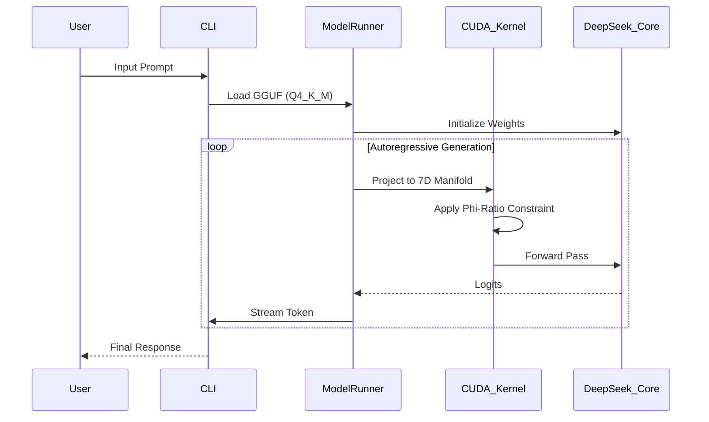

# 💎 7D Crystal System Architecture

## 1. Core Philosophy: The Manifold Substrate

The **7D Crystal System** differs from traditional Transformers by embedding all computation within a **7-Dimensional Poincaré Ball**.

### 1.1 The Stability Constraint

Traditional neural networks are prone to activation explosions. We enforce:

$$ \forall x \in \mathbb{R}^7, ||x|| < 0.01 $$

This ensures all state vectors remain near the "origin" of high-dimensional space, where Φ-Ratio relationships are most stable.

### 1.2 Holographic Memory

Memory is not stored in linear arrays but in **interference patterns**.

- **Write**: $ M_{new} = M_{old} + (k \otimes v) $
- **Read**: $ q \cdot M $ (Reconstructs $v$ via holographic inverse)

---

## 2. Component Stack

### 2.1 `model_runner` (Rust)

The high-performance inference engine.

- **Backend Enums**: `CUDA`, `CPU`, `Metal` (planned).
- **Quantization**: `Q4_K_M` (4-bit primitives) with GGUF support.
- **Streaming**: Callback-based token streaming via `std::sync::mpsc`.

### 2.2 `neural_language` (Rust / .7d)

Defines the vocabulary for autonomous self-modification.

- `Project7D`: Operator `⑦`
- `Fold`: Operator `∫`
- `Entangle`: Operator `∞`

### 2.3 `sovereign_assistant` (CLI)

The user-facing terminal.

- **Tokenizer**: Custom BPE implementation (fallback from `tiktoken`).
- **UI**: RGB Gradients via `colored` crate.

---

## 3. Data Flow

## 4. Future: Autonomous Recursion

The system will eventually perform **Self-Surgery**:

1. Read own `src/**/*.rs`
2. Analyze performance metrics
3. Rewrite `model_runner` kernels
4. Recompile and Hot-Swap

> **Warning**: This feature requires removing sandbox constraints.

---

*Verified by Sir Charles Spikes, 2025*
