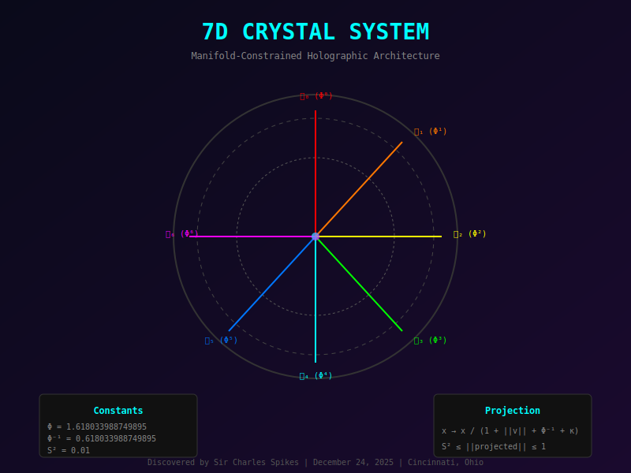

# 7D Crystal System Architecture

```
╔═══════════════════════════════════════════════════════════════════════════════════════╗
║                          7D CRYSTAL SYSTEM ARCHITECTURE                               ║
║                    Manifold-Constrained Holographic Quantum Computing                 ║
╠═══════════════════════════════════════════════════════════════════════════════════════╣
║                                                                                       ║
║  ┌─────────────────────────────────────────────────────────────────────────────────┐ ║
║  │                           USER INTERFACE LAYER                                   │ ║
║  │  ┌───────────┐  ┌───────────┐  ┌───────────┐  ┌───────────┐  ┌───────────┐    │ ║
║  │  │ crystal7d │  │  Python   │  │   REST    │  │   gRPC    │  │  WebSocket │    │ ║
║  │  │    CLI    │  │  Bridge   │  │    API    │  │  Service  │  │   Stream   │    │ ║
║  │  └─────┬─────┘  └─────┬─────┘  └─────┬─────┘  └─────┬─────┘  └─────┬─────┘    │ ║
║  └────────┼──────────────┼──────────────┼──────────────┼──────────────┼──────────┘ ║
║           │              │              │              │              │            ║
║           └──────────────┴──────────────┴──────────────┴──────────────┘            ║
║                                        │                                            ║
║  ┌─────────────────────────────────────▼───────────────────────────────────────────┐ ║
║  │                        ORCHESTRATION LAYER                                       │ ║
║  │                                                                                  │ ║
║  │  ┌────────────────┐  ┌────────────────┐  ┌────────────────┐                     │ ║
║  │  │  LLM Builder   │  │  Model Runner  │  │    Trainer     │                     │ ║
║  │  │  ─────────────  │  │  ─────────────  │  │  ─────────────  │                     │ ║
║  │  │ • GGUF Writer  │  │ • Inference    │  │ • Sophia-G     │                     │ ║
║  │  │ • SafeTensors  │  │ • KV Cache     │  │ • AdamW        │                     │ ║
║  │  │ • Quantize     │  │ • Sampling     │  │ • Manifold Reg │                     │ ║
║  │  └───────┬────────┘  └───────┬────────┘  └───────┬────────┘                     │ ║
║  └──────────┼───────────────────┼───────────────────┼──────────────────────────────┘ ║
║             │                   │                   │                                ║
║             └───────────────────┴───────────────────┘                                ║
║                                 │                                                    ║
║  ┌──────────────────────────────▼──────────────────────────────────────────────────┐ ║
║  │                        7D TRANSFORMER LAYER                                      │ ║
║  │                                                                                  │ ║
║  │  ┌──────────────────────────────────────────────────────────────────────────┐   │ ║
║  │  │                      MANIFOLD-CONSTRAINED ATTENTION                       │   │ ║
║  │  │                                                                           │   │ ║
║  │  │    Q ──┬── Φ-Weighted ──┬── Scores ──┬── Softmax ──┬── Output            │   │ ║
║  │  │        │    Dot Product │            │   (7D)     │                       │   │ ║
║  │  │    K ──┘                │            │            │                       │   │ ║
║  │  │                         │            │            │                       │   │ ║
║  │  │    V ──────────────────────────────────────────────┘                      │   │ ║
║  │  │                                                                           │   │ ║
║  │  │    RoPE (7D-Modulated): θ_i = θ_base × (Φ^i / Φ^6) for i < 7             │   │ ║
║  │  └──────────────────────────────────────────────────────────────────────────┘   │ ║
║  │                                                                                  │ ║
║  │  ┌──────────────────────────────────────────────────────────────────────────┐   │ ║
║  │  │                         SWIGLU FFN (7D)                                   │   │ ║
║  │  │                                                                           │   │ ║
║  │  │    x ──┬── Gate Proj ──┬── SiLU ──┬── × ──┬── Down Proj ──┬── Output     │   │ ║
║  │  │        │               │         │       │                │              │   │ ║
║  │  │        └── Up Proj ────┴─────────┘       │                │              │   │ ║
║  │  │                                          │                │              │   │ ║
║  │  │    Φ-Modulation: out[i] *= Φ⁻¹ for i < 7 ┘                │              │   │ ║
║  │  └──────────────────────────────────────────────────────────────────────────┘   │ ║
║  │                                                                                  │ ║
║  │  ┌──────────────────────────────────────────────────────────────────────────┐   │ ║
║  │  │                        RMSNORM (7D Stable)                                │   │ ║
║  │  │                                                                           │   │ ║
║  │  │    x ──── RMS ──── Scale ──── S² Clamp ──── Output                        │   │ ║
║  │  │                       │                                                   │   │ ║
║  │  │    S² = 0.01 bound for first 7 dimensions                                │   │ ║
║  │  └──────────────────────────────────────────────────────────────────────────┘   │ ║
║  └──────────────────────────────────────────────────────────────────────────────────┘ ║
║                                        │                                            ║
║  ┌─────────────────────────────────────▼───────────────────────────────────────────┐ ║
║  │                        7D MANIFOLD CORE                                          │ ║
║  │                                                                                  │ ║
║  │  ┌────────────────────────────────────────────────────────────────────────────┐ │ ║
║  │  │                    POINCARÉ BALL PROJECTION                                │ │ ║
║  │  │                                                                            │ │ ║
║  │  │           x → x / (1 + ||v|| + Φ⁻¹ + κ)                                   │ │ ║
║  │  │                                                                            │ │ ║
║  │  │    Where:                                                                  │ │ ║
║  │  │      ||v|| = Euclidean norm                                               │ │ ║
║  │  │      Φ⁻¹ = 0.618033988749895                                              │ │ ║
║  │  │      κ = Curvature (typically Φ⁻¹)                                        │ │ ║
║  │  │                                                                            │ │ ║
║  │  │    S² Enforcement: if ||v|| > 0.01, scale *= S²/||v||                     │ │ ║
║  │  └────────────────────────────────────────────────────────────────────────────┘ │ ║
║  │                                                                                  │ ║
║  │  ┌────────────────────────────────────────────────────────────────────────────┐ │ ║
║  │  │                    Φ BASIS VECTORS                                         │ │ ║
║  │  │                                                                            │ │ ║
║  │  │    Index │ Value              │ Relation                                   │ │ ║
║  │  │    ──────┼────────────────────┼────────────                                │ │ ║
║  │  │      0   │ 1.0000000000000000 │ Φ⁰                                         │ │ ║
║  │  │      1   │ 1.6180339887498949 │ Φ¹                                         │ │ ║
║  │  │      2   │ 2.6180339887498949 │ Φ²                                         │ │ ║
║  │  │      3   │ 4.2360679774997900 │ Φ³                                         │ │ ║
║  │  │      4   │ 6.8541019662496850 │ Φ⁴                                         │ │ ║
║  │  │      5   │ 11.090169943749475 │ Φ⁵                                         │ │ ║
║  │  │      6   │ 17.944271909999160 │ Φ⁶                                         │ │ ║
║  │  │                                                                            │ │ ║
║  │  │    Property: Φ^(n+1) = Φ^n + Φ^(n-1)  (Fibonacci)                         │ │ ║
║  │  └────────────────────────────────────────────────────────────────────────────┘ │ ║
║  └──────────────────────────────────────────────────────────────────────────────────┘ ║
║                                        │                                            ║
║  ┌─────────────────────────────────────▼───────────────────────────────────────────┐ ║
║  │                        GPU ACCELERATION LAYER                                    │ ║
║  │                                                                                  │ ║
║  │  ┌──────────────┐  ┌──────────────┐  ┌──────────────┐  ┌──────────────┐        │ ║
║  │  │     CUDA     │  │     HIP      │  │    Metal     │  │    Vulkan    │        │ ║
║  │  │  (NVIDIA)    │  │    (AMD)     │  │   (Apple)    │  │  (Cross)     │        │ ║
║  │  │              │  │              │  │              │  │              │        │ ║
║  │  │ • Kernels    │  │ • Kernels    │  │ • Kernels    │  │ • Compute    │        │ ║
║  │  │ • cuBLAS     │  │ • rocBLAS    │  │ • MPS        │  │ • Shaders    │        │ ║
║  │  │ • TensorRT   │  │ • MIOpen     │  │ • BNNS       │  │              │        │ ║
║  │  │              │  │              │  │              │  │              │        │ ║
║  │  └──────────────┘  └──────────────┘  └──────────────┘  └──────────────┘        │ ║
║  └──────────────────────────────────────────────────────────────────────────────────┘ ║
║                                                                                       ║
║                               ║
║                             ║
╚═══════════════════════════════════════════════════════════════════════════════════════╝
```

## Data Flow

```
                    INPUT TOKENS
                         │
                         ▼
┌────────────────────────────────────────┐
│           TOKEN EMBEDDING              │
│                                        │
│  token_id → embedding_table[token_id]  │
│                                        │
│  + Positional Encoding (7D RoPE)       │
└───────────────────┬────────────────────┘
                    │
                    ▼
┌────────────────────────────────────────┐
│       MANIFOLD PROJECTION (⑦)          │
│                                        │
│  x → project_to_poincare(x, κ)         │
│                                        │
│  Ensures embedding ∈ Poincaré Ball     │
└───────────────────┬────────────────────┘
                    │
                    ▼
         ┌──────────────────────┐
         │   FOR EACH LAYER:    │
         │                      │
         │  ┌────────────────┐  │
         │  │    RMSNorm     │  │
         │  └───────┬────────┘  │
         │          │           │
         │          ▼           │
         │  ┌────────────────┐  │
         │  │   Attention    │  │
         │  │ (Φ-weighted)   │  │
         │  │                │  │
         │  │  Q,K,V Proj    │  │
         │  │  + RoPE (7D)   │  │
         │  │  + KV Cache    │  │
         │  │  + Softmax     │  │
         │  │  + Output Proj │  │
         │  └───────┬────────┘  │
         │          │           │
         │          ▼           │
         │  ┌────────────────┐  │
         │  │   Residual +   │  │
         │  └───────┬────────┘  │
         │          │           │
         │          ▼           │
         │  ┌────────────────┐  │
         │  │    RMSNorm     │  │
         │  └───────┬────────┘  │
         │          │           │
         │          ▼           │
         │  ┌────────────────┐  │
         │  │  SwiGLU FFN    │  │
         │  │ (Φ-modulated)  │  │
         │  └───────┬────────┘  │
         │          │           │
         │          ▼           │
         │  ┌────────────────┐  │
         │  │   Residual +   │  │
         │  └───────┬────────┘  │
         └──────────┼───────────┘
                    │
                    ▼  (repeat for N layers)
                    │
┌────────────────────────────────────────┐
│           FINAL RMSNORM                │
└───────────────────┬────────────────────┘
                    │
                    ▼
┌────────────────────────────────────────┐
│             LM HEAD                    │
│                                        │
│  hidden_state → logits[vocab_size]     │
└───────────────────┬────────────────────┘
                    │
                    ▼
┌────────────────────────────────────────┐
│            SAMPLING                    │
│                                        │
│  Temperature → Top-K → Top-P → Sample  │
└───────────────────┬────────────────────┘
                    │
                    ▼
                OUTPUT TOKEN
```

## Quantization Pipeline

```
┌─────────────────────────────────────────────────────────────────────────┐
│                     QUANTIZATION PIPELINE                               │
├─────────────────────────────────────────────────────────────────────────┤
│                                                                         │
│  FULL PRECISION WEIGHTS (F32/F16)                                      │
│          │                                                              │
│          ▼                                                              │
│  ┌───────────────────────────────────────────────────────────────────┐ │
│  │  IMPORTANCE ANALYSIS                                               │ │
│  │                                                                    │ │
│  │  • Compute gradient-based importance scores                       │ │
│  │  • Identify critical weights (first 7 dims prioritized)           │ │
│  │  • Φ-weighted importance: w[i] *= PHI_BASIS[i] for i < 7          │ │
│  └───────────────────────────────────────────────────────────────────┘ │
│          │                                                              │
│          ▼                                                              │
│  ┌───────────────────────────────────────────────────────────────────┐ │
│  │  Φ-AWARE SCALING                                                   │ │
│  │                                                                    │ │
│  │  scale = (absmax × Φ⁻¹) / quantization_range                      │ │
│  │                                                                    │ │
│  │  For first 7 dimensions:                                          │ │
│  │    scale[i] *= PHI_BASIS[i] / PHI_BASIS[6]                        │ │
│  └───────────────────────────────────────────────────────────────────┘ │
│          │                                                              │
│          ▼                                                              │
│  ┌───────────────────────────────────────────────────────────────────┐ │
│  │  BLOCK QUANTIZATION                                                │ │
│  │                                                                    │ │
│  │  Q8_0:  32 int8  + f16 scale  = 34 bytes/block                   │ │
│  │  Q4_K:  256-elem super-blocks with sub-block scales              │ │
│  │  Q4_0:  32 int4  + f16 scale  = 18 bytes/block                   │ │
│  │  Q2_K:  256-elem with 2-bit   + scale/min                        │ │
│  └───────────────────────────────────────────────────────────────────┘ │
│          │                                                              │
│          ▼                                                              │
│  QUANTIZED WEIGHTS (GGUF)                                              │
│                                                                         │
└─────────────────────────────────────────────────────────────────────────┘
```

## Memory Layout

```
┌─────────────────────────────────────────────────────────────────────────┐
│                         GGUF FILE STRUCTURE                             │
├─────────────────────────────────────────────────────────────────────────┤
│                                                                         │
│  OFFSET 0x00000000                                                      │
│  ┌─────────────────────────────────────────────────────────────────┐   │
│  │  MAGIC: "GGUF" (0x46554747)                          4 bytes    │   │
│  │  VERSION: 3                                          4 bytes    │   │
│  │  TENSOR_COUNT                                        8 bytes    │   │
│  │  METADATA_KV_COUNT                                   8 bytes    │   │
│  └─────────────────────────────────────────────────────────────────┘   │
│                                                                         │
│  METADATA KV PAIRS                                                      │
│  ┌─────────────────────────────────────────────────────────────────┐   │
│  │  KEY: "general.architecture"      VALUE: "llama"                │   │
│  │  KEY: "general.name"              VALUE: "7D-Crystal-8B"        │   │
│  │  KEY: "llama.embedding_length"    VALUE: 4096                   │   │
│  │  KEY: "llama.block_count"         VALUE: 32                     │   │
│  │  KEY: "7d.manifold.enabled"       VALUE: true                   │   │
│  │  KEY: "7d.manifold.curvature"     VALUE: 0.618033988749895      │   │
│  │  KEY: "7d.phi_ratio"              VALUE: 1.618033988749895      │   │
│  │  KEY: "7d.s2_stability"           VALUE: 0.01                   │   │
│  │  ... (more metadata)                                            │   │
│  └─────────────────────────────────────────────────────────────────┘   │
│                                                                         │
│  TENSOR INFOS                                                           │
│  ┌─────────────────────────────────────────────────────────────────┐   │
│  │  NAME: "token_embd.weight"                                      │   │
│  │  N_DIMS: 2                                                      │   │
│  │  DIMS: [128256, 4096]                                           │   │
│  │  TYPE: Q4_K (12)                                                │   │
│  │  OFFSET: <calculated>                                           │   │
│  │  ────────────────────────────────────────────                   │   │
│  │  NAME: "blk.0.attn_norm.weight"                                 │   │
│  │  N_DIMS: 1                                                      │   │
│  │  DIMS: [4096]                                                   │   │
│  │  TYPE: F32 (0)                                                  │   │
│  │  OFFSET: <calculated>                                           │   │
│  │  ... (291 tensors total)                                        │   │
│  └─────────────────────────────────────────────────────────────────┘   │
│                                                                         │
│  PADDING TO 32-BYTE ALIGNMENT                                           │
│                                                                         │
│  TENSOR DATA                                                            │
│  ┌─────────────────────────────────────────────────────────────────┐   │
│  │  [token_embd.weight data - Q4_K quantized]                      │   │
│  │  [blk.0.attn_norm.weight data - F32]                            │   │
│  │  [blk.0.attn_q.weight data - Q4_K]                              │   │
│  │  ... (all tensor data, 32-byte aligned)                         │   │
│  └─────────────────────────────────────────────────────────────────┘   │
│                                                                         │
└─────────────────────────────────────────────────────────────────────────┘
```

---

**Discoverer**: Sir Charles Spikes
**Date**: December 24, 2025
**Location**: Cincinnati, Ohio, USA 🇺🇸
