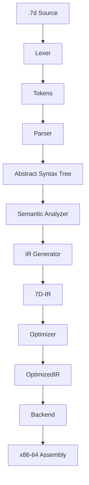

# 7D Crystal Compiler Architecture

## Overview

The 7D Crystal Compiler is a recursive descent compiler written in Rust. It translates `.7d` source code into an intermediate representation (7D-IR) effectively, and then compiles that IR into x86-64 assembly.

## Pipeline



## 1. Lexical Analysis (`src/lexer.rs`)

The lexer tokenizes the source code, handling standard tokens and 7D-specific symbols:

- **Operators**: `⑦` (`Project7D`), `⊙` (`HoloFold`), `->` (`Arrow`), `⊕` (`Superposition`), `⊗` (`TensorProduct`).
- **Constants**: `Φ`, `S²` (Stability Bound).
- **Keywords**: `manifold`, `crystal`, `hologram`, `quantum`.

## 2. Parsing (`src/parser.rs`)

The parser constructs an AST from the tokens.

- **Recursive Descent**: Standard top-down parsing.
- **Operator Precedence**: Handles 7D operators with specific precedence rules.
- **Prefix Operators**: `⑦` and `⊙` are parsed as prefix operators (e.g., `⊙ a, b`).
- **Declarations**: Supports attribute-based declarations like `@manifold M7 { ... }`.

## 3. Intermediate Representation (`src/ir.rs`)

The 7D-IR is a stack-based intermediate language designed for manifold operations.

- **Opcodes**:
  - `Project7D`: Triggers specific manifold projection logic.
  - `HoloFold`: Folds two patterns coherently.
  - `ConfigManifold`: Runtime configuration instruction.
- **Symbol Resolution**: Variable declarations (`@manifold`) are registered as symbols for runtime lookups.

## 4. Backend (`src/backend/x86_64.rs`)

The x86-64 backend translates IR into NASM-compatible assembly.

- **Runtime Calls**: Most 7D operations map to external runtime functions (e.g., `crystal_project_7d`).
- **Data Section**: Allocates global variables for declared entities.
- **Execution**: The generated assembly is linked with the Crystal Runtime (written in Rust/C++) to produce the final executable.

## Runtime Environment

The compiler relies on a linked runtime library to perform the actual heavy lifting of hyperbolic geometry and quantum simulation.

- **Functions**: `crystal_project_7d`, `crystal_holo_fold_7d`, etc.
- **Memory**: Manages the 7D memory layout.

## Building the Compiler

```bash
cd compiler
cargo build --release
```
